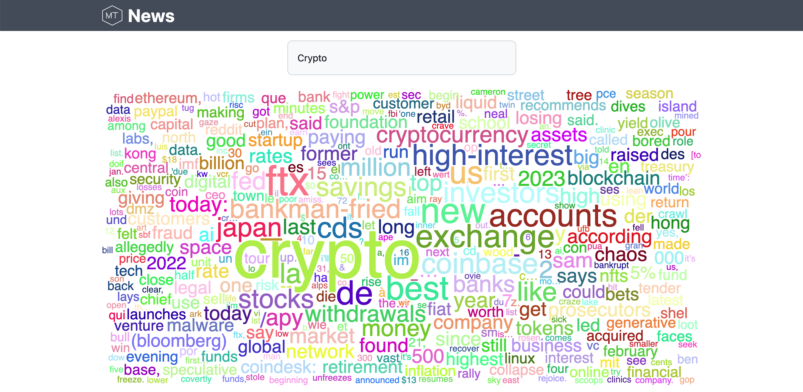
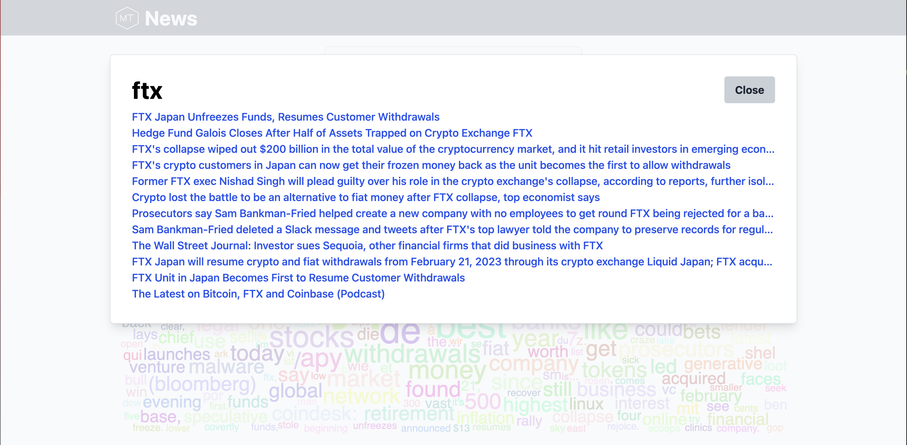

# News Word Cloud
Create a word cloud for words found in recent news articles, so that you can visualize common words among articles which may reveal popular topics.

## Example
### Word Cloud

### Specific Item from Word Cloud

## Running locally
1. Create a api key at `https://newsapi.org/`
1. Install node
1. Copy `api/local.settings-sample.json` to `api/local.settings.json` and fill in any missing values
1. Run the web app emulator: `npx @azure/static-web-apps-cli start`
